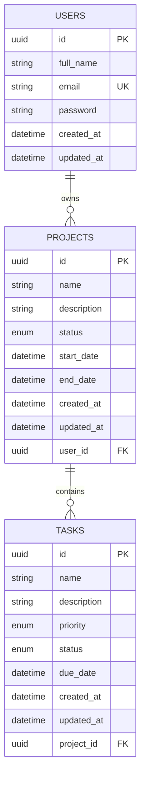

# Database Schema

## Entity Relationship Diagram

## Tables

### users

| Column     | Type         | Constraints                |
|------------|--------------|----------------------------|
| id         | UUID         | PRIMARY KEY                |
| full_name  | VARCHAR      | NOT NULL                   |
| email      | VARCHAR      | NOT NULL, UNIQUE           |
| password   | VARCHAR      | NOT NULL (bcrypt hashed)   |
| created_at | TIMESTAMP    | DEFAULT NOW()              |
| updated_at | TIMESTAMP    | AUTO UPDATE                |

### projects

| Column      | Type         | Constraints                          |
|-------------|--------------|--------------------------------------|
| id          | UUID         | PRIMARY KEY                          |
| name        | VARCHAR      | NOT NULL                             |
| description | TEXT         | NULLABLE                             |
| status      | ENUM         | NOT_STARTED, IN_PROGRESS, COMPLETED  |
| start_date  | TIMESTAMP    | NULLABLE                             |
| end_date    | TIMESTAMP    | NULLABLE                             |
| created_at  | TIMESTAMP    | DEFAULT NOW()                        |
| updated_at  | TIMESTAMP    | AUTO UPDATE                          |
| user_id     | UUID         | FOREIGN KEY → users(id) ON DELETE CASCADE |

### tasks

| Column      | Type         | Constraints                          |
|-------------|--------------|--------------------------------------|
| id          | UUID         | PRIMARY KEY                          |
| name        | VARCHAR      | NOT NULL                             |
| description | TEXT         | NULLABLE                             |
| priority    | ENUM         | LOW, MEDIUM, HIGH                    |
| status      | ENUM         | PENDING, IN_PROGRESS, COMPLETED      |
| due_date    | TIMESTAMP    | NULLABLE                             |
| created_at  | TIMESTAMP    | DEFAULT NOW()                        |
| updated_at  | TIMESTAMP    | AUTO UPDATE                          |
| project_id  | UUID         | FOREIGN KEY → projects(id) ON DELETE CASCADE |

## Relationships

- **User → Projects**: One-to-many. Each project belongs to exactly one user.
- **Project → Tasks**: One-to-many. Each task belongs to exactly one project.
- **Cascade deletes**: Deleting a user removes their projects; deleting a project removes its tasks.

## Indexes

- `projects.user_id` — fast lookup of projects by owner
- `projects.status` — filter projects by status
- `tasks.project_id` — fast lookup of tasks by project
- `tasks.status` — filter tasks by status
- `tasks.priority` — filter tasks by priority

## Security Notes

- Passwords are hashed with bcrypt (12 salt rounds) before storage.
- All queries use Prisma ORM parameterized statements (SQL injection safe).
- Authorization enforced at the API layer: users can only access their own data.
